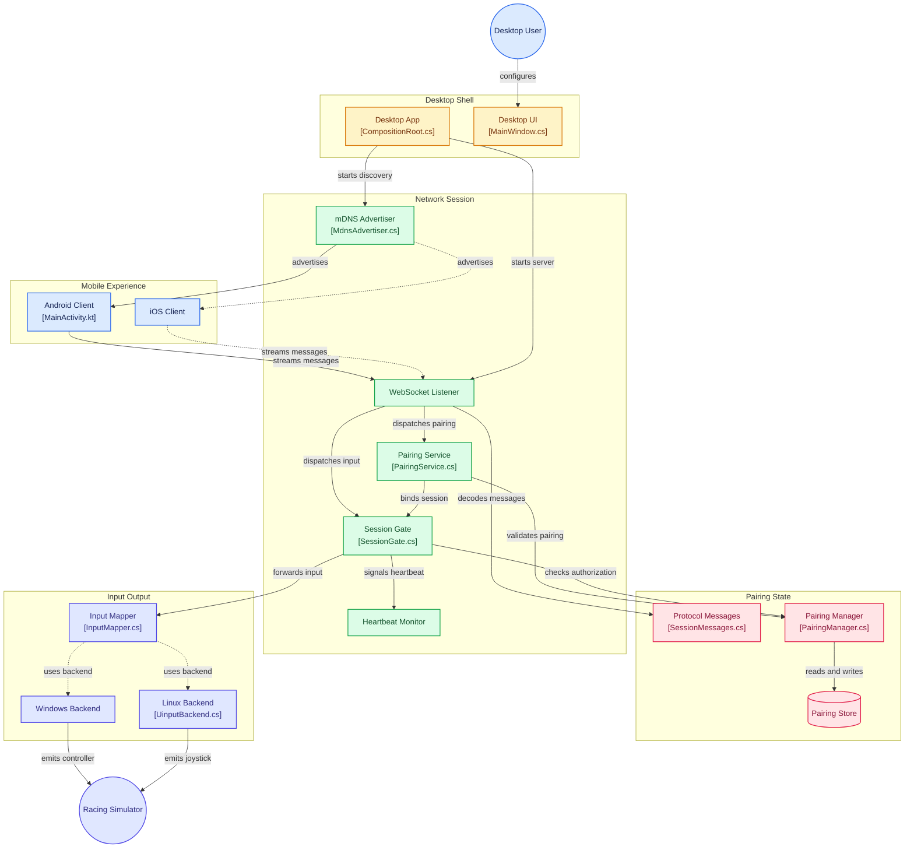

# WheelDeck project structure



## Repository layout

Single monorepo covering the mobile app, the desktop server, and the shared protocol definitions.

```
WheelDeck/
├── docs/
│   ├── prd.md
│   ├── backend-interface.md
│   ├── mobile-interface.md
│   ├── project-structure.md
│   ├── desktop-dev-guide.md
│   ├── mobile-dev-guide.md
│   └── adr/
│
├── protocol/
│   └── schema/
│       ├── state_message.json
│       ├── button_message.json
│       ├── session_messages.json
│       └── controls.json
│
├── mobile/
│   ├── lib/
│   │   ├── main.dart                      # Entry point, Provider + Material 3 theme (AppTheme), routing (Onboarding → Menu → Driving)
│   │   ├── data/
│   │   │   ├── repositories/              # Connection, discovery, session, paired devices, settings, pedal/sensor/onboarding
│   │   │   └── services/                  # WheelDeckClient, discovery, pairing, gyroscope, steering/pedal/dashboard input, controller presets & layouts, permissions
│   │   ├── domain/
│   │   │   └── models/                    # ConnectionStatus/Target, DiscoveredServer, PairingChallenge, Steering/Pedal state (freezed)
│   │   └── ui/
│   │       ├── core/                      # connection_coordinator.dart, lifecycle_observer.dart, theme/app_theme.dart (ColorScheme.fromSeed)
│   │       └── features/
│   │           ├── menu/                  # MenuScreen — M3 hub (logo, title, Connect/Settings/About/Donate) post-onboarding
│   │           ├── connection/            # ConnectionScreen + ManualAddSheet (FAB modal), view_models/connection_view_model.dart + PairedDeviceRepository split
│   │           ├── driving/               # DrivingView (wheel + PedalPanel + Dashboard, recalibrate FAB), calibration_overlay/view, view_models/driving_view_model.dart
│   │           ├── onboarding/            # OnboardingScreen + permissions
│   │           ├── settings/              # SettingsScreen (mapping, controller type, pedal layout, presets, reset) + view_models/settings_view_model.dart
│   │           ├── about/                 # AboutScreen — developer, source, GitHub stars badge (http)
│   │           └── donate/                # DonateScreen — BuyMeACoffee/PayPal/Ko-fi via url_launcher
│   ├── android/
│   ├── ios/
│   ├── test/                              # mirrors lib/ui/features + data/ with widget/unit tests
│   └── pubspec.yaml                       # url_launcher, http, provider, shared_preferences, etc.
│
├── desktop/
│   ├── WheelDeck.sln
│   ├── WheelDeck.App/              # Avalonia UI + composition root
│   │   ├── Program.cs              # Entry point (GUI or --daemon)
│   │   ├── CompositionRoot.cs      # DI, picks VirtualOutputBackend by OS
│   │   ├── SetupChecker.cs         # First-run HIDMaestro/uinput check
│   │   ├── Views/                  # XAML views
│   │   └── ViewModels/             # MVVM view models
│   ├── WheelDeck.Core/             # Domain logic (no OS dependencies)
│   │   ├── Protocol/               # Message models from protocol/schema/
│   │   ├── Pairing/                # PairingManager, IPairingStore, session tokens
│   │   ├── Input/                  # InputMapper, MappingMode
│   │   └── Network/                # WebSocketListener, PairingService, SessionGate, HeartbeatMonitor
│   ├── WheelDeck.Backends/
│   │   ├── Windows/                # HIDMaestro virtual Xbox 360 controller
│   │   └── Linux/                  # uinput virtual joystick
│   └── WheelDeck.Tests/            # xunit unit tests
│
├── scripts/
│   ├── linux/
│   │   └── install-uinput-rules.sh
│   └── windows/
│       └── check-hidmaestro.ps1
│
├── .github/
│   └── workflows/
│       ├── mobile-ci.yml
│       └── desktop-ci.yml
│
├── LICENSE
└── README.md
```

## Directory rationale

### protocol/

Both backend-interface.md and mobile-interface.md describe the same message formats and control enums independently. That is fine for docs, but two hand-maintained copies of the same enum will drift in code. protocol/schema/ is the single source of truth. Both mobile/ and desktop/ generate or reference their language-specific types from these files instead of defining them twice. This prevents the exact bug where a new dashboard control gets added on one side and forgotten on the other.

### desktop/WheelDeck.Backends/

Kept as separate projects per platform (Windows/, Linux/) rather than one project with runtime OS checks scattered through it. Each implements the VirtualOutputBackend interface from backend-interface.md. WheelDeck.Core depends only on the interface, never on a specific backend. The composition root (WheelDeck.App) picks the right implementation at startup based on the running OS. This is what makes "drop macOS support for now, add it later" cheap. A new folder implementing the same interface, not a rewrite.

### scripts/

First-run setup friction is called out as a non-functional requirement in the PRD: verify HIDMaestro or uinput permissions instead of failing silently. These scripts are what the WheelDeck.App first-run check runs automatically or points the user to. They are also useful to run manually during development on Fedora.

### mobile/lib/ internal layout

Current layout is `data/` (repositories + services) / `domain/` (freezed models) / `ui/` (core + features), which refines the original three-layer model from mobile-interface.md: `data/services` = Input Capture + Network Client layers, `ui/features` = UI layer. `ConnectionCoordinator` + `LifecycleObserver` live in `ui/core`; theming in `ui/core/theme`. The previous `input/`/`network/`/`state/` sketch is superseded — see tree above for authoritative layout.

### CI split

Separate mobile-ci.yml and desktop-ci.yml rather than one combined workflow. They build on different runners: Flutter tooling vs. .NET plus platform-specific driver dependencies for backend tests. A mobile-only change should not wait on a full desktop build matrix, or the reverse.

## Not included yet

No ios/ signing config, no installer or packaging scripts, no CONTRIBUTING.md. These matter once there is working code to ship, not before. Add them after initial prototyping, not as part of this structure decision.
