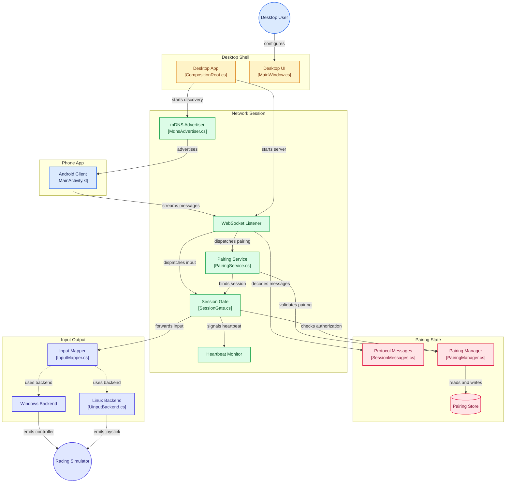

# WheelDeck project structure


```mermaid
flowchart TD

subgraph group_mobile["Phone App"]
  node_android_client["Android Client<br/>[MainActivity.kt]"]
end

subgraph group_desktop["Desktop Shell"]
  node_desktop_app["Desktop App<br/>[CompositionRoot.cs]"]
  node_desktop_ui["Desktop UI<br/>[MainWindow.cs]"]
end

subgraph group_network["Network Session"]
  node_mdns["mDNS Advertiser<br/>[MdnsAdvertiser.cs]"]
  node_websocket["WebSocket Listener"]
  node_pairing_service["Pairing Service<br/>[PairingService.cs]"]
  node_session_gate["Session Gate<br/>[SessionGate.cs]"]
  node_heartbeat["Heartbeat Monitor"]
end

subgraph group_pairing["Pairing State"]
  node_protocol["Protocol Messages<br/>[SessionMessages.cs]"]
  node_pairing_manager["Pairing Manager<br/>[PairingManager.cs]"]
  node_pairing_store[("Pairing Store")]
end

subgraph group_output["Input Output"]
  node_input_mapper["Input Mapper<br/>[InputMapper.cs]"]
  node_windows_backend["Windows Backend"]
  node_linux_backend["Linux Backend<br/>[UinputBackend.cs]"]
end

node_desktop_user(("Desktop User"))
node_simulator(("Racing Simulator"))

node_desktop_user -->|"configures"| node_desktop_ui
node_mdns -->|"advertises"| node_android_client
node_android_client -->|"streams messages"| node_websocket
node_websocket -->|"decodes messages"| node_protocol
node_websocket -->|"dispatches pairing"| node_pairing_service
node_websocket -->|"dispatches input"| node_session_gate
node_pairing_service -->|"validates pairing"| node_pairing_manager
node_pairing_manager -->|"reads and writes"| node_pairing_store
node_pairing_service -->|"binds session"| node_session_gate
node_session_gate -->|"checks authorization"| node_pairing_manager
node_session_gate -->|"forwards input"| node_input_mapper
node_session_gate -->|"signals heartbeat"| node_heartbeat
node_input_mapper -.->|"uses backend"| node_windows_backend
node_input_mapper -.->|"uses backend"| node_linux_backend
node_windows_backend -->|"emits controller"| node_simulator
node_linux_backend -->|"emits joystick"| node_simulator
node_desktop_app -->|"starts server"| node_websocket
node_desktop_app -->|"starts discovery"| node_mdns

click node_android_client "https://github.com/fazrigading/wheeldeck/blob/main/android/app/src/main/kotlin/dev/fazrigading/wheeldeck/MainActivity.kt"
click node_desktop_app "https://github.com/fazrigading/wheeldeck/blob/main/desktop/WheelDeck.App/CompositionRoot.cs"
click node_desktop_ui "https://github.com/fazrigading/wheeldeck/blob/main/desktop/WheelDeck.App/MainWindow.cs"
click node_mdns "https://github.com/fazrigading/wheeldeck/blob/main/desktop/WheelDeck.Core/Network/MdnsAdvertiser.cs"
click node_websocket "https://github.com/fazrigading/wheeldeck/blob/main/desktop/WheelDeck.Core/Network/WebSocketListener.cs"
click node_pairing_service "https://github.com/fazrigading/wheeldeck/blob/main/desktop/WheelDeck.Core/Network/PairingService.cs"
click node_session_gate "https://github.com/fazrigading/wheeldeck/blob/main/desktop/WheelDeck.Core/Network/SessionGate.cs"
click node_heartbeat "https://github.com/fazrigading/wheeldeck/blob/main/desktop/WheelDeck.Core/Network/HeartbeatMonitor.cs"
click node_protocol "https://github.com/fazrigading/wheeldeck/blob/main/desktop/WheelDeck.Core/Protocol/SessionMessages.cs"
click node_pairing_manager "https://github.com/fazrigading/wheeldeck/blob/main/desktop/WheelDeck.Core/Pairing/PairingManager.cs"
click node_pairing_store "https://github.com/fazrigading/wheeldeck/blob/main/desktop/WheelDeck.Core/Pairing/JsonFilePairingStore.cs"
click node_input_mapper "https://github.com/fazrigading/wheeldeck/blob/main/desktop/WheelDeck.Core/Input/InputMapper.cs"
click node_windows_backend "https://github.com/fazrigading/wheeldeck/blob/main/desktop/WheelDeck.Backends/Windows/HidMaestroBackend.cs"
click node_linux_backend "https://github.com/fazrigading/wheeldeck/blob/main/desktop/WheelDeck.Backends/Linux/UinputBackend.cs"

classDef toneNeutral fill:#f8fafc,stroke:#334155,stroke-width:1.5px,color:#0f172a
classDef toneBlue fill:#dbeafe,stroke:#2563eb,stroke-width:1.5px,color:#172554
classDef toneAmber fill:#fef3c7,stroke:#d97706,stroke-width:1.5px,color:#78350f
classDef toneMint fill:#dcfce7,stroke:#16a34a,stroke-width:1.5px,color:#14532d
classDef toneRose fill:#ffe4e6,stroke:#e11d48,stroke-width:1.5px,color:#881337
classDef toneIndigo fill:#e0e7ff,stroke:#4f46e5,stroke-width:1.5px,color:#312e81
classDef toneTeal fill:#ccfbf1,stroke:#0f766e,stroke-width:1.5px,color:#134e4a
class node_android_client,node_desktop_user toneBlue
class node_desktop_app,node_desktop_ui toneAmber
class node_mdns,node_websocket,node_pairing_service,node_session_gate,node_heartbeat toneMint
class node_protocol,node_pairing_manager,node_pairing_store toneRose
class node_input_mapper,node_windows_backend,node_linux_backend,node_simulator toneIndigo
```

## Repository layout

Single monorepo covering the Android phone app, the desktop server, and the shared protocol definitions.

```
WheelDeck/
├── docs/
│   ├── prd.md
│   ├── backend-interface.md
│   ├── mobile-interface.md
│   ├── project-structure.md
│   ├── desktop-dev-guide.md
│   ├── mobile-dev-guide.md
│   └── adr/
│
├── protocol/
│   └── schema/
│       ├── state_message.json
│       ├── button_message.json
│       ├── session_messages.json
│       └── controls.json
│
├── android/                               # The phone app: Kotlin 2.x + Jetpack Compose, one :app module
│   ├── gradle/libs.versions.toml          # Version catalog — the single place a dependency version is named
│   ├── gradlew                            # Wrapper; no local Gradle install needed
│   └── app/
│       ├── build.gradle.kts               # minSdk 26, targetSdk 36, compileSdk 37, BuildConfig
│       └── src/
│           ├── main/
│           │   ├── AndroidManifest.xml    # INTERNET, CHANGE_WIFI_MULTICAST_STATE
│           │   └── kotlin/dev/fazrigading/wheeldeck/
│           │       ├── MainActivity.kt
│           │       ├── WheelDeckApplication.kt
│           │       ├── AppContainer.kt    # Manual DI: services + repositories
│           │       ├── domain/models/     # ControlId, ActionType, wire messages, ConnectionStatus
│           │       ├── data/
│           │       │   ├── services/      # WheelDeckClient, discovery, pairing, gyro, steering/pedal/dashboard input, layout, presets, settings store, permissions, external links
│           │       │   └── repositories/  # Connection, discovery, session, paired devices, settings, onboarding
│           │       └── ui/
│           │           ├── core/          # AppShell (routing), ConnectionCoordinator, ControlPress, LifecycleObserver, theme
│           │           └── features/
│           │               ├── menu/      # MenuScreen — M3 hub (logo, title, Connect/Settings/About/Donate)
│           │               ├── connection/# ConnectionScreen + ManualAddSheet, ConnectionViewModel
│           │               ├── driving/    # DrivingScreen, BlockGrid, RotatableWheel, PedalPanel, CameraPad, DrivingViewModel
│           │               ├── onboarding/ # OnboardingScreen + OnboardingViewModel
│           │               ├── settings/   # SettingsScreen, KeybindConfigurationScreen, BindingEditDialog, SettingsViewModel
│           │               ├── about/      # AboutScreen — developer, source, GitHub stars badge
│           │               └── donate/     # DonateScreen — BuyMeACoffee/PayPal/Ko-fi via LinkOpener
│           └── test/                       # JVM unit tests, mirroring the main tree
│
├── desktop/
│   ├── WheelDeck.sln
│   ├── WheelDeck.App/              # Avalonia UI + composition root
│   │   ├── Program.cs              # Entry point (GUI or --daemon)
│   │   ├── CompositionRoot.cs      # DI, picks VirtualOutputBackend by OS
│   │   ├── SetupChecker.cs         # First-run HIDMaestro/uinput check
│   │   ├── Views/                  # XAML views
│   │   └── ViewModels/             # MVVM view models
│   ├── WheelDeck.Core/             # Domain logic (no OS dependencies)
│   │   ├── Protocol/               # Message models from protocol/schema/
│   │   ├── Pairing/                # PairingManager, IPairingStore, session tokens
│   │   ├── Input/                  # InputMapper, MappingMode
│   │   └── Network/                # WebSocketListener, PairingService, SessionGate, HeartbeatMonitor
│   ├── WheelDeck.Backends/
│   │   ├── Windows/                # HIDMaestro virtual Xbox 360 controller
│   │   └── Linux/                  # uinput virtual joystick
│   └── WheelDeck.Tests/            # xunit unit tests
│
├── scripts/
│   ├── linux/
│   │   └── install-uinput-rules.sh
│   └── windows/
│       └── check-hidmaestro.ps1
│
├── .github/
│   └── workflows/
│       ├── android-ci.yml
│       ├── desktop-ci.yml
│       └── release.yml
│
├── LICENSE
└── README.md
```

## Directory rationale

### protocol/

Both backend-interface.md and mobile-interface.md describe the same message formats and control enums independently. That is fine for docs, but two hand-maintained copies of the same enum will drift in code. protocol/schema/ is the single source of truth. Both android/ and desktop/ define their language-specific types against these files rather than inventing them, and the phone side pins the contract with `ControlIdContractTest` and `WireMessagesTest`. This prevents the exact bug where a new dashboard control gets added on one side and forgotten on the other.

### desktop/WheelDeck.Backends/

Kept as separate projects per platform (Windows/, Linux/) rather than one project with runtime OS checks scattered through it. Each implements the VirtualOutputBackend interface from backend-interface.md. WheelDeck.Core depends only on the interface, never on a specific backend. The composition root (WheelDeck.App) picks the right implementation at startup based on the running OS. This is what makes "drop macOS support for now, add it later" cheap. A new folder implementing the same interface, not a rewrite.

### scripts/

First-run setup friction is called out as a non-functional requirement in the PRD: verify HIDMaestro or uinput permissions instead of failing silently. These scripts are what the WheelDeck.App first-run check runs automatically or points the user to. They are also useful to run manually during development on Fedora.

### android/ internal layout

`data/` (repositories + services) / `domain/` (data classes) / `ui/` (core + features), which refines the original three-layer model from mobile-interface.md: `data/services` = Input Capture + Network Client layers, `ui/features` = UI layer. `AppShell` + `ConnectionCoordinator` + `ControlPress` live in `ui/core`; theming in `ui/core/theme`.

This layout was carried over from the Flutter app unchanged, so the layer model in mobile-interface.md still describes it. Two Kotlin-specific departures: no codegen (`data class` replaces `freezed`), and `AppShell` now owns routing where `main.dart` used to.

### CI split

Separate android-ci.yml and desktop-ci.yml rather than one combined workflow. They build on different toolchains: JDK and the Gradle Android plugin vs. .NET plus platform-specific driver dependencies for backend tests. An Android-only change should not wait on a full desktop build matrix, or the reverse.

## Not included yet

No ios/ signing config, no installer or packaging scripts, no CONTRIBUTING.md. These matter once there is working code to ship, not before. Add them after initial prototyping, not as part of this structure decision.
